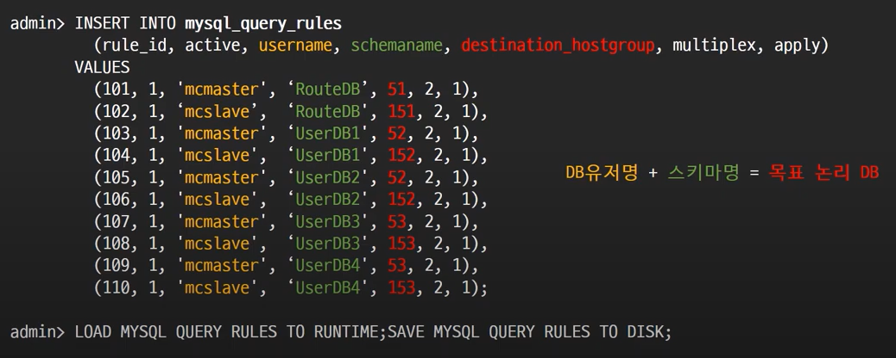
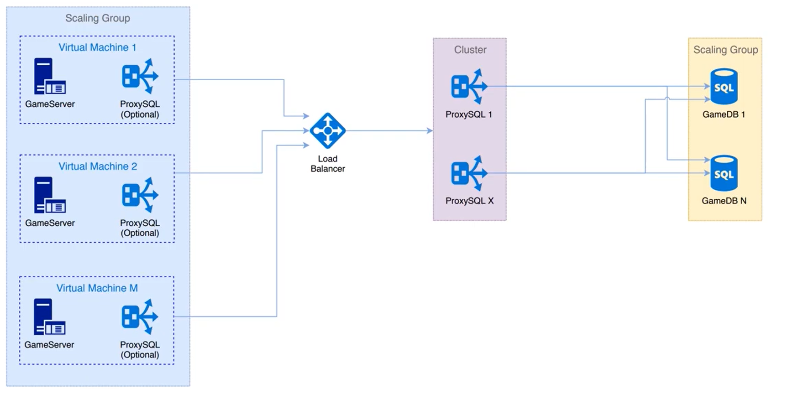

### 200만 동접 게임을 위한 MYSQL 샤딩

연사: NHN 게임기술센터/ 게임서버엔진팀 전만철

* 2020년 실제 닌텐도의 "Dr.MARIO WORLD" 게임에 적용된 DB 아키텍처에 대한 리뷰글임을 미리 명시함

### 문제상황

* 게임 서버와 db를 연결하는 과정에서 1:1 매핑 구조로 만들 수가 없음

  -> 유저는 게임 서버 중 어느 곳에든 접속할 수 있어야 함

  ​	-> 이를 위해서 게임 서버는 db 중 어느 곳에든 접속이 가능하여 사용자의 정보를 가져올 수 있어야 함

* 이 때 서버의 수와 DB의 수가 증가함으로 인해 각 서버가 DB로 맺는 Connection Pool이 큰 폭으로 증가하게 됨

​		** **Connection Pool** - 데이터베이스로의 추가 요청이 필요할 때 연결을 재사용할 수 있도록 관리되는 데이터베이스 연결의 **캐시**

 			즉 db에 연결되는 Connection을 미리 만들어서 pool 속에 저장해두고 있다가 필요할 때 Connection을 pool에서 쓰고 다시 pool에 반환하는 기법

* Connection이 많아져 서비스가 불가능한 상황이 됨으로 이를 해결하는 것을 목표로 함

* 문제 해결을 위해 투명한 미들웨어가 게임서버와 DB 사이의 관계를 정리해주면 좋겠다고 생각함

  -> 게임 서버가 미들웨어로 요청하면 미들웨어가 그정보를 받아 DB에 접속하는 방법을 1차적으로 구상함

### 해결 방안에 대한 구상

* 새로운 계층(Proxy Layer)에 대한 요구사항

  1) DB에 대한 Connection 관리 및 요구량을 완화 (가장 중요함)

  2. 구현할 필요가 없고 MySQL 프로토콜을 인식해야 함 
  3. Clustering과 Scalability 지원, 고성능이며 오픈소스여야 함
  4. 적용 실패 시 쉽게 fade-out 할 수 있어야 함

  -> 리서치 결과 이 모든 조건의 만족하는 **ProxySQL**을 채택함

### ProxySQL이란?

* MySQL과 호환 DB들을 위한 고성능, 고가용성 프록시로서 MySQL 프로토콜 자체를 인식하여 동작함
* **외부의 connection을 받아 쿼리를 중계**해주는 쿼리 라우팅(Query routing) 기능을 핵심으로 하는 proxy database
* 설정되어 있는 backend db에 주기적으로 health check를 보내고 이들 중 하나가 죽으면 auto failover를 해주며 로드 밸런싱과 유사한 기능을 함
* Master/Slave 구조로 인해 데이터베이스가 많은 수로 read replication되어 있는 상태에서 효율적으로 커넥션을 분배해주고, 외부에서 많은 양의 커넥션이 들어오는 경우 효과적으로 connection을 pooling 함

* 서버에서 Proxy SQL을 봤을 때는 MySQL 서버로 인지함

  mysql native protocol을 사용해 쿼리를 던지기 때문

  <-> 백앤드 db에서 봤을 때 ProxySQL은 그냥 appliation임

  ​		쿼리를 던지는 application으로 인식하게 됨

### Connection Multiplexing

* 보통 MySQL이 사용하는 "thread per connection"이 아닌 "**thread pool**" 방법을 사용하여 DB에 대한 connection 수를 극적으로 줄여주는 핵심 기능

  ** **thread per connection**: MySQL 서버는 기본적으로 하나의 클라이언트가 MySQL 서버에 접속할 때마다 해당 클라이언트에 종속적인 thread를 생성하고 해당 커넥션의 thread 역할(쿼리 작업)이 끝나면 thread를 제거함. 

** **thread pool**: 클라이언트의 접속 요청 시 thread를 생성하는 것이 아닌 기존에 생성된 thread를 할당해주어 client 요청에 대한 connection overhead가 없음

* 이를 통해 많은 수의 Front-end connection들을 효율적으로 적은 양의 Back-end connection들로 muxing할 수 있음

** **muxing(다중화)**: 두개 이상의 저수준의 채널들을 하나의 고수준의 채널로 통합하는 과정

* 여러 Game Server로부터 ProxySQL로 오는 커넥션이 multiplexing되어 connection 수가 줄어들음

### Schema 기반의 샤딩

* ProxySQL에서 제공하는 샤딩의 종류로 게임 유저를 정해진 Schema로 샤딩하는 방법

  -> 임의의 게임 유저는 각자의 data가 적재되어 있는 논리 DB로 Rule 기반하여 접근

  ex) 해당 게임유저가 원하는 schema로 쿼리를 던지면 해당 schema에 접근함

### User 기반의 샤딩

* DB 유저를 정해진 MySQL 서버로 샤딩

  -> 임의의 MySQL 서버 유저는 정해진 MySQL 서버로 Rule에 기반하여 샤딩

  ex) 게임 유저가 아닌 DB 유저가 sql 서버를 지정하면 해당 서버로 쿼리가 전송됨

* **DB유저명+스키마명 = 목표 논리 DB ** 

-> 원하는 스키마와 DB유저를 지정하면 여러 db 서버 중에 어떤 곳으로 쿼리가 도달해야 되는지가 결정됨

### 위에 나온 기능들에 대한 코드 예제 설명

* MySQL Client를 통해 admin 계정으로 클러스터링 구성 가능

  -> 4개의 ip에 대해서 해당 ProxySQL 서버들을 클러스터링하고 있음

* 스키마 기반 샤딩과 유저 기반의 샤딩을 혼합한 형태로 query rule을 통해 조작 가능함

* Mysql 유저명을 보통 master와 slave로 나누어 놓음

* RouteDB, UserDB는 유저가 접속할 수 있는 스키마명

  -> 유저명과 DB명을 조합하여 빨간색으로 보이는 hostgroup으로 쿼리를 보내라는 query 규칙이 세워짐

### ProxySQL의 MySQL Replication

** **MySQL Replication(이중화)** : 2대 이상의 DBMS를 나누어 저장하는 방식 -> Master/Slave로 구성됨

​	Master DBMS: 웹서버로부터 데이터 등록/수정/삭제 요청 시 바이너리로그를 생성하여 Slave 서버로 전달

​	Slave DBMS: Master DBMS로부터 전달받은 바이너리 로그를 데이터로 반영함(보통 SELECT 문으로 조회할 때 사용)

​	-> 이를 통해 데이터를 백업하고 db서버의 부하를 분산할 수 있음

* ProxySQL은 자체적으로 MySQL replication hostgroup 정보를 관리할 수 있음

  -> **Query rule**을 통해 이중화가 이루어짐 = 정규표현식으로 쿼리 패턴을 매칭하는 것  ex) SELECT라는 단어가 등정하면 Slave로, INSERT, UPDATE는 Master

  **But** 복합적인 쿼리가 계속해서 생각나고 서비스 중 새로운 패턴의 쿼리가 생성되면 어떻게 함??

  -> 패턴 등록이 잘못되어 잘못된 db로 들어갈 수 있으므로 MySQL Username을 쿼리 패턴에 이용함

  여기서 말하는 MySQL Username은 연구자가 자체적으로 지정한 hostgroup id와 매핑되게끔 설계함

  -> 51,52,53과 같은 두 자리 숫자는 Master, 151,152,153과 같은 세 자리 숫자는 Slave라는 룰을 정해놓은 후 ip, 포트번호와 함께 각 서버들을 등록해놓음

### Schema 샤딩

* 위에 언급된 Schema 기반의 샤딩과 다름
* 각각의 물리 MySQL 서버를 여러 개의 논리 Schema로 구성함

* 한 서버 내에서 논리 Schema들이 같은 호스트 id들을 공유함

* 일반적으로 스키마 수가 많아지면 관리 비용이 많아지지만 유저수가 변화할 때 대응하기 쉬움

* 코드의 복잡도도 높아져야 하지만 ProxySQL에서 스키마에 대한 정보를 관리하므로 상관 없음

* 스키마 샤딩의 가장 큰 장점은 유저 수의 증감에 따라 논리 스키마를 여러 서버로 분산할 수도 있고 하나의 서버로 합칠 수 있다는 것

  -> 스키마 샤딩 시 유저는 자신의 고유한 스키마에 정보를 저장하게 됨

  모든 유저와 스키마 사이의 매핑 정보는 **RouteDB**에서 관리함

### Route DB

* RouteDB의 문제점은 모든 유저가 서비스에 접속하기 위해선 본인의 스키마의 저장 위치를 찾기위해 RouteDB를 조회해야 한다는 것
* 위 그림에서 2번 프로세스로 가기 전에 RouterDB로 전달하는 과정에서 **동접자 수가 많아진다면** **병목현상**이 발생하게 됨

* 이를 해결하기 위해 RouteDB의 캐시를 저장한 Redis를 먼저 탐색하게끔 설계도를 바꿈

  -> 코드 복잡도가 높아짐

​		-> RouterDB를 어떻게 fade-out 할 지에 대한 고민을 함

### Murmur Hash

* Murmur Hash라는 해싱 기법은 좋은 분포를 갖고 있고 cpu 성능이 좋으며 충돌률이 낮아 200만 동접자에 대한 성능이 우수하다고 판단함

* UserDB index = f(UniqueID) % N 

  **UniqueID: 고유한 유저ID

  **N: 전체 논리DB의 개수(100개로 고정함)

* 이 해싱함수를 통해 유저는 RouteDB 조회를 하지 않고 바로 본인의 정보가 저장되어있는 DB를 찾아갈 수 있게됨

### 최종 아키텍처

* 게임 서버는 Load Balancer를 통해 ProxySQL에 접속하는데 이 때 ProxySQL은 mysql 서버로 쿼리를 날리는 것으로 인식함
* ProxySQL은 백앤드의 db 정보를 관리해줌

출처: 

1. https://www.youtube.com/watch?v=8Eb_n7JA1yA
2. https://blog.naver.com/PostView.nhn?isHttpsRedirect=true&blogId=ssang8417&logNo=221858327113&categoryNo=24&parentCategoryNo=0&viewDate=&currentPage=1&postListTopCurrentPage=1&from=postView
3. https://planbs.tistory.com/entry/ProxySQL
4. https://m.blog.naver.com/PostView.naver?isHttpsRedirect=true&blogId=jevida&logNo=221272057153
5. https://server-talk.tistory.com/240