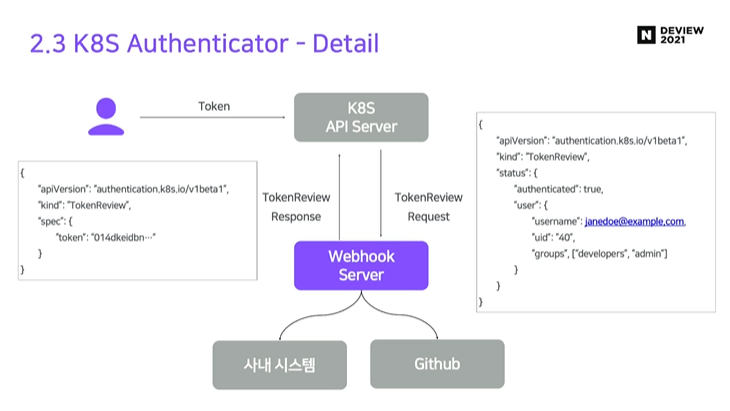

## 2021 NAVER DEVIEW CLOps: 넌 모델링만해, 난 서빙할테니 리뷰

### 서빙 플랫폼이 필요하게 된 배경

#### 모델러와 엔지니어의 정의

모델러: 모델을 개발하고 학습시키며 성능 평가를 하는 사람

엔지니어: 개발된 모델을 서빙 가능한 형태로 개발하고 최적화하는 사람

#### 모델링과 엔지니어링의 유기적 관계

대부분 개발된 모델은 엔지니어링을 거치며 모델 방법에 따라 필요한 엔지니어링 기술이 달라질 수 있고 서빙을 위해 막대한 컴퓨팅 리소스가 필요함

잘 만든 모델의 안정적 서비스를 위해 엔지니어링 기술이 필요함

엔지니어링을 통해 서빙된 모델은 다양한 성능지표를 통해 재학습될 수 있고 또 다시 엔지니어링 과정을 거쳐 서빙됨

-> 유기적으로 연결되어야 하지만 기술 영역이 다르다보니 매끄럽게 연결되지 않는 경우가 많음

#### CLOps 프로젝트의 목표

엔지니어링 관점에서 모델 서빙을 하려함

​			"CLOVA" + "MLOps"

#### 엔지니어링 관점에서 모델 서빙의 어려운 점

* 새로운 모델이 나올 때 마다 서빙을 위한 장비 발주가 필요함
* 모델별 배포 관리가 필요함
* 서빙되는 모델들의 모니터링, 엔드포인트 관리
* 트래픽 많은 모델에는 스케일 관리가 필요함

-> 이를 해결하기 위해 많은 기능을 지원해주는 쿠버네티스(K8S)를 사용함

#### 모델 서빙을 위한 필수 요소

* Auth: 인가된 모델러에 의해서만 서빙 가능하도록 하는 인증 시스템 -> K8S Authenticator
* Application: 모델러가 손쉽게 배포하여 서빙가능하도록 함 -> Operator
* Machine Scheduling: 모델이 필요로 하는 컴퓨팅 리소스(CPU/GPU)를 할당 -> Scheduler
* HPA(Horizontal Pod Autoscaler): 사용자 트레픽에 따라 안정적 운영을 가능하도록 함 -> HPA
* Model Registry: 개발한 모델을 등록 -> Model Registry

#### 컴포넌트의 구성도

 

출처: https://tv.naver.com/v/23651794

* 모든 사용자 인터페이스는 CLOps CLI를 통해 이뤄짐

* API SERVER에서 프록시 역할과 클러스터 역할이 필요한 일부 기능들을 사용자에게 제한적으로 제공해줌

* 각 모델 서버에는 executor라는 것이 붙어서 배포됨 -> 모델 서버의 리버스 프록시 역할을 하여 동기/비동기 지원, 메트릭 관리, 인증 처리 등 다양한 일을 함
* 서빙되는 모델에 대한 트레픽은 Istio를 통해 관리함

#### 리소스 구성도

* CLOps 로그인한 사용자는 모델 서빙을 위해 우선 프로젝트를 생성함-> 이는 K8S 상에서 Namespace를 의미함

  -> 해당 프로젝트에 접근 가능한 유저 정보,  서빙에 필요한 다양한 리소스들의 쿼터 정보, 사용가능 cpu, gpu  정보를 할당함으로써 Multi-tenant를 가능하게 함

  이는 Kubeflow의 profile과 비슷한 기능임

### Authenticator

* 접근제어를 함

* 인가된 사용자에 의해서만 CLOps 사용가능 

* 프로젝트별 권한 관리 -> 권한에 따라 각각 다른 기능 사용 가능하게 함

* K8S는 여러가지 인증 방법을 제공하는데  (Ex. Static Token, Webhook, Bootstrap Token, Authenticating Proxy, X509 Client Cert) 

  이 중 Webhook 방식을 택함

** **Webhook** - 토큰 인증을 다른 서버로 위임하는 방식

-> 사내 시스템이나 Github에 플랫폼을 연동하여 인증 토큰을 발행하기 위함

-> 인증 과정에서 사용자와 관련된 Role 정보를 지정할 수 있기 때문에

-> 여러 component에 인증 수단을 간단히 제공할 수 있음

* 사용자가 K8S API를 호출하게 되면 K8S는 사용자로부터 전달 받은 토큰을 Webhook 서버에 전달하여 인증 여부를 확인함
* 인증 여부는 Webhook 서버에서 자체적으로 처리할 수 있지만 필요에 따라 외부 시스템(사내 시스템, 깃허브)를 통해 인증 처리할 수 있음
* Webhook 서버로 전달되는 Request는 Token Review라는 Object 형태로 전달되며 이 Object 안에 사용자의 토큰이 담겨져 있음 
* Webhook response에는 인증 성공에 대한 Boolean 값과 성공했을 시 binding 되어야 할 Role의 정보들을  담을 수 있음
* Webhook 설정(Config)은 K8S api 서버의 config file argument로 설정이 가능함

### K8S Operator

* 모델 서빙을 위한 필요 기능 자동화

* 모델 서빙을 운영하기 위해서는 어플리케이션 배포 뿐 아니라 운영을 위한 부가적 기능들이 동반됨

* 엔지니어링 경험이 적을 경우 필요한 기능을 구현하는데 많은 비용(시간적 비용?)이 발생함

  -> 대부분 기능들은 재사용 가능하게 표준화하여 제공한다면 모델 배포를 쉽고 빠르게 할 수 있음

* 간단한 요구 명세를 통해 배포가 가능한 기능을 구현하였음
* Operator는 Kubebuilder라는 SDK를 통해 쉽게 구현이 가능함

* **Resource**: K8S에서는 Yaml 형태로 표현이 가능한 내용을 리소스라고 하며 의도를 담은 레코드라고 표현함

  -> 사용자가 K8S API 사용을 하기 위한 인터페이스 역할을 함

  ex) Deployment, Service, DaemonSet과 같은 리소스가 제공됨

* **Custom Resource**: K8S가 제공중인 기본 리소스 외 어플리케이션 제공자가 정의한 K8S 리소스로 안정적으로 확장 가능함
* **Operator**는 Custom Resource라는 인터페이스를 통해 리소스의 요구 상태를 제출하고 현재 상태를 요구 상태에 맞게 조정함

* Operator는 사용자로부터 요구상태에 대한 명세를 받아 custom resource 형태로 저장하고 object에 대한 변화 이벤트를 트리거로 받아 현재상태와 비교함

-> 요구 상태와 현재 상태를 비교해 상태를 변경함

* Operator의 매커니즘

  1. 단순 기본값 설정 및 검증

     * CRD(Custom Resource Definition) Struct에 정의된 단일 필드에 대한 기본값 설정 및 검증

       -> 해당 리소스가 어떤 필드를 갖고, 필드가 어떤 형을 갖는지, 이 값이 필수값인지 선택인지 등에 대해 단일 필드에 대해 정의함

     * 이를 기반으로 복합 필드에 대한 설정과 검증을 함

  2. 필드 변경

     * 검증이 통과되면 요구 상태가 Operator에 전달됨

       But 바로 전달되는게 아니라 Operator가 관리하는 Event Queue에 적재됨

       Operator는 요구 상태와 현재 상태를 비교하고 동기화함

       모든 과정이 완료되면 Custom Resource의 status 상태를 update하고 Reconcile 단계를 완료함

  3. 조정
     * Requeing을 통해 조정 상태가 변경하려는 상태와 맞는지 비교

   이를 통해 모델 어플리케이션 변경 없이 사이드카 형태로 Executor를 주입할 수 있으며 sync/async, provider/consumer 기능도 사용 가능함

  -> 요청을 Proxing하는 과정에서 로깅, 매트릭과 같은 미들웨어 추가가 용이하고 모델 엔드포인트를 일반화할 수 있음

  **Proxy**: 클라이언트가 자신을 통해서 다른 네트워크 서버에 간접적으로 접속할 수 있게 해주는 응용 프로그램이나 컴퓨터 시스템을 프록시 서버라 하고

  ​			서버와 클라이언트 사이에 중계기로서 대리로 통신을 수행하는 것을 가리켜 프록시라고 함

  ​			이 때 Proxy 서버는 보통 캐싱(caching) 기능이 있어 자주 들어오는 요청에 대한 response 내용을 저장했다가 바로 보여줌으로써 성능을 높일 수 있			음

  **Sidecar Proxy**: K8S에서 pod에 일반적으로 하나의 container를 띄우는데 부가적으로 함께 다른 도커 이미지를 띄우는 경우

  **Sidecar Pattern**: 어플리케이션 컨테이너와 독립적으로 동작하는 별도의 컨테이너를 붙이는 패턴 

  

  * 기존 모델 어플리케이션 컨테이너에 Executor가 주입된 Container를 연결함

    -> 앞단에서 트래픽을 전달받아 proxy하는 형태로 진행되며 여러 미들웨어를 어플리케이션 수정 없이 주입할 수 있음

  * 여러 모델이 배포되어 있을 때 서로 다른 엔드포인트를 갖는 모델에 대해서 단일 엔드포인트로 묶어주는 기능도 수행이 가능

    -> 이를 통해 여러 모델의 트래픽을 제어하고 모델 성능을 테스트해볼 수 있음

  **Endpoint**: 쿠버네티스의 파드(pod)와 서비스(service)는 EST 오브젝트로 서비스 정의를 API 서버에 POST하여 새 인스턴스를 생성할 수 있음

  ​					이 때 사용자가 지정한 이름(위 그림에선 'main')으로 엔드포인트가 생성되고 이 오브젝트는 서비스 프록시가 사용하는 IP주소가 할당됨

  * 로깅 포워드 -> 모델 어플리케이션에 대한 로깅을 엘라스틱 서치와 같은 외부시스템에 보내줄 수 있음
  * 로컬 머신에 도커 환경이 설정되어 있지 않아도 이미지 빌드 파이프라인을 실행하여 로컬 데이터 전송을 자동화할 수 있음
  * 트래픽량에 따라 오토스케일링, 모델 레지스트리 및 캐시, 모델 요청 형태 제어, 요청량 제어와 같은 다양한 기능을 붙일 수 있음

  #### Operator 구현에 필요한 팁

  * 멱등성이 보장되게 구현해야 함 -> 요구 상태에 따라서 생성되는 리소스는 항상 같아야 함

    이를 지키지 않는다면 reconcile 과정에서 상태를 비교할 수 없고 requeing 과정에서 상태가 다른지 비교할 수 없으므로 무한루프를 돌 수 있음

  * Operator resource가 api 요청을 줄이기 위해 내부 매니저에서 캐싱을 할 수 있는데 의도치 않게 이전 데이터가 들어오기 때문에 주의해야 함
  * 컨트롤러 리소스 참조관계를 설정하여 리소스가 삭제될 때 컨트롤러가 함께 삭제되게 해야함
  * Custom Resource를 정의할 때 필드 타입이 일반 데이턴지 포인터 변수인지에 따른 이해가 필요함  

  

* 정의된 Custom 

