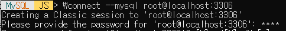

Django Mysql 연동


### 1) 연동을 위해 mysqlclient 다운로드

```bash
pip install mysqlclient
```


### 2) MYSQL 다운로드 및 데이터베이스 생성

-> 로컬에 Mysql 인스톨 후 mysqlsh에서 데이터베이스를 생성함

1> mysql 접속



\connect 후에 사용자 정보를 입력함


2> sql 모드로 query문 전송


utf8_general_ci를 쓰면 utf8mb4로 설정해야한다는 warning이 뜸

-> 찾아본 결과 기존에 mysql은 utf8을 3byte 가변 자료형으로 설계했는데 최근 나온 4byte

 문자열을 저장하면 값이 손실되는 현상을 발견함

​	-> 4byte 가변 자료형을 utf8mb4이란 charset으로 추가함


### 3) Model 생성

* 모델이란?

  -> 부가적인 메타데이터를 가진 데이터베이스의 구조를 말함

1> Model.py 파일 수정


* django는 모델 파일을 통해 database의 스키마를 관리함

  -> 모델 객체를 만들어 migration을 해주면 객체가 테이블로 변환됨

  

#### Migration은 어떻게 이루어지나?

```
python manage.py makemigration (app name)
```


* django의 모델을 수정한 후 해당 명령어를 통해 migration file을 생성할 수 있음
* 이 때 app_name을 명시함으로써 어떤 app에 대한 마이그레이션을 할 지 정할 수 있음

```
python manage.py migrate (app name) (migration_name)
```


* 실제로 migration을 적용하는 명령어로 db 스키마에 대한 변경사항이 실제로 db에 적용됨

* migration_name을 명시해주면 해당 파일을 기준으로 db 내용을 변경할 수 있음

  -> 이를 통해 db의 버전 관리를 해줄 수 있어 오류 시 롤백을 하기에 편리함


