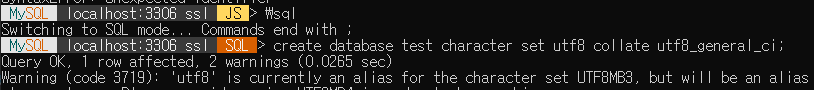

Django Mysql 연동


### 1) 연동을 위해 mysqlclient 다운로드

```bash
pip install mysqlclient
```


### 2) MYSQL 다운로드 및 데이터베이스 생성

-> Mysql 인스톨 후 mysqlsh에서 데이터베이스를 생성함

1> mysql 접속


\connect 후에 사용자 정보를 입력함


2> sql 모드로 query문 전송



utf8_general_ci를 쓰면 utf8mb4로 설정해야한다는 warning이 뜸

-> 찾아본 결과 기존에 mysql은 utf8을 3byte 가변 자료형으로 설계했는데 최근 나온 4byte

 문자열을 저장하면 값이 손실되는 현상을 발견함

​	-> 4byte 가변 자료형을 utf8mb4이란 charset으로 추가함


### 3) Model 생성

* 모델이란?

  -> 부가적인 메타데이터를 가진 데이터베이스의 구조를 말함

1> Model.py 파일 수정