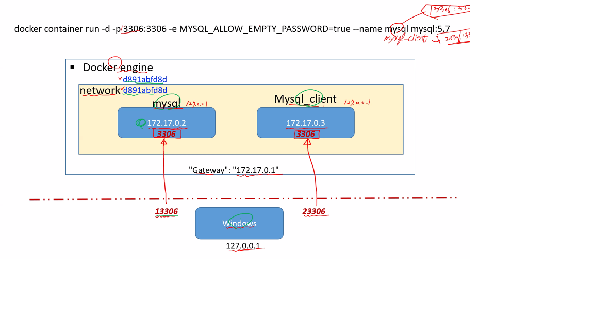

## Docker


### 기본 명령어

* `docker version` - 버전 확인

* `docker image ls` - 도커 이미지 상태 확인

* `docker ps` - `docker container ls`대신 쓸 수 있음

* `doker container start (컨테이너 id or Names)` : 컨테이너 실행

* `doker container stop (컨테이너 id or Names)` : 컨테이너 중지

* `docker container rm(컨테이너 id or Names) `: 컨테이너 삭제

* `docker rmi (이미지)` : 이미지 삭제

* `-f` : 안지워질 때 강제로 지우는 옵션

* `docker container inspect`: 컨테이너의 세부정보를 자세하게 볼 수 있음

* `docker logs ${Container ID}`: 로그정보를 볼 수 있음

* `docker system prune` : 안쓰는 이미지, 컨테이너, 볼륨같은 걸 지워줌

* `docker network ls` : 도커 네트워크 환경 보여줌

  

### ls를 통한 상태정보 확인

* `docker container ls` :도커 컨테이너 상태 확인

```powershell
CONTAINER ID   IMAGE                    COMMAND                  CREATED         STATUS         PORTS                NAMES
80d3c8bf567c   docker/getting-started   "/docker-entrypoint.…"   5 minutes ago   Up 5 minutes   0.0.0.0:80->80/tcp   hopeful_colden
```

* Container ID - 가상화했을 때 부여되는 unique한 Id

* Image - Container가 만들 때 기본이 되는 image

* Command- Container 작동을 위해 가장 마지막 실행된 커맨드

* Created - 생성시간

* Status - Up(작동중), Exit(종료)

* Ports- 현재 컨테이너가 작동되기 위해 운영되는 포트

->(화살표) 포워딩을 뜻함

Ex) 0.0.0.0:80->80/top

--->외부에서 80이란 포트로 도커 엔진에 요청하면 내부 컨테이너의 80포트로 연결한다는 뜻

* Names : 랜덤하게 부여가 됨

`docker container ls -a` : 현재 실행되지 않는, 중지된 컨테이너까지 보여줌


### 클라우드 네이티브 아키텍처

1) MSA(MicroService Architecture) - 서비스를 마이크로 단위로 쪼개고

RestFul API와 같이 심플한 방법으로 통신하고 연계해 응용프로그램을 구성함

작은 단위의 프로그램을 운영해야함

2) CI(Continuous Integration)/CD(Continuous Deployment)

- 애플리케이션 개발 단계를 자동화하여 애플리케이션을 보다 짧은 주기로 고객에게 제공하는 방법. 

지속적인 통합, 서비스 제공, 배포가 주된 개념임

3) DevOps

4) Container가상화

-Docker - 조금더 가볍고, 이식성이 높게 가상화할 수 있게끔 함

운영체제를 가상화시키는거에서 넘어서 백엔드 프로그램, 데이터베이스 등을 컨테이너 상태로 추상화 함

-> 이를 통해 개발 환경, 운용환경, 유저 테스트 환경 등에서 통합된 환경을 이용할 수 있음


### Docker와 기존 가상화의 차이점

1)기존 가상화 방식 --> OS를 가상화

- VMWare, VirtualBox는 Host OS위에 GuestOS 전체를 가상화함 -> 무겁고 느리다

기본 구조 : 서버(HardWare)-HostOS(Windows)-Hypervisor(가상화기술)-> GuestOS(리눅스)

-> 개발환경(라이브러리-> 어플리케이션

2) CPU의 가상화 기술 이용방식(Kernel-based Virtual Machine)

- 전체를 OS 가상화 하지않음, 호스트 형식에 비해 속도 향상

Ex) Openstack, AWS 등의 클라우드 서비스

* 추가적인 OS는 여전히 필요함

3) 컨테이너 가상화

* CPU나 메모리는 프로세스에 필요한 만큼만 추가로 사용

* 성능 손실 거의 없음
* 컨테이너들 사이는 서로 영향을 주지 않음
* 컨테이너 생성 속도 빠름(서버 하나를 기동할 때)
* 무조건 OS가 필요하긴 함(python, mysql등 미들웨어 실행을 위해서 무조건 OS가 필요하므로)

**But,** 경량화된 OS를 쓴다는 점에서 차이가 있고 (경량OS+ 라이브러리 or SDK)이므로 이미지 사이즈 자체가 작음

*** tag에 alpine이 들어가면 최소화된 경량버전임

기본 구조 : 서버-> HostOS-> Docker Engine(Docker 서버라고도 함)-> 개발환경(라이브러리)-> 어플리케이션


### Docker image

- 컨테이너 실행에 필요한 파일과 설정 값 등을 포함한 설치 파일같은 것
- 도커 컨테이너를 구성하는 파일 시스템과 실행할 어플리케이션 설정을 합친 것으로 컨테이너를 생성하는 템플릿 역할을 함
- 상태값이 없다 -> 사용자의 고유정보(Id, PW 등)를 갖고 있지 않다는 뜻임/ 사용할 수 없는 상태
- 실체화:  이미지에 사용자 정보가 들어가 사용할 수 있는 상태

* **이미지가 실체화된 상태를 Container라고 함**

VIrtual Box에서 우분투 서버를 가상화할 때 썼던 1.56GB의 .iso파일은 이미지 파일이었음!

이미지 얻는 방법 

1) Public 다운로드(docker Hub에 등록) - "pull" 명령어로 다운로드 받음

이 때 hub.docker.com에는 tag로 보통 서로 다른 모델을 구별해줌

```powershell
docker pull ubuntu:16.04
```

-> 16.04 버전의 우분투 이미지를 다운받음

이 때 다른 tag의 이미지 간 공유하는 파일들을 새로 다운받지 않고 그대로 가져다 씀

2) Private 다운로드 (Container Registry)

3) Image 직접 생성 - "create"를 통해 생성함

** 'run'은 다운받은 이미지나 생성한 이미지를 실체화 시켜줌

** **volume mount**

-host pc가 갖고 있는 특정한 드라이브를 도커에서 사용할 수 있도록 마운트를 해놓으면 컨테이너가 지워지더라도

데이터 값을 os내에 저장해놓을 수 있음

** **Layer 저장방식**

-> 유니온 파일 시스템을 이용 -> 여러개의 layer를 하나의 파일 시스템으로 사용 가능

쉽게 설명하면 1)에서 서로다른 tag가 파일을 공유하는 것처럼 이미지 간에 공유하는 파일은 새로 생성하지 않고

필요한 부분만 따로 layer로 추가하여 `A+B+C`로 된 기존 이미지에 `D`라는 layer를 추가하는 방식


```powershell
PS C:\Users\user> docker image rm 8185511cd5ad
Untagged: ubuntu:16.04
Untagged: ubuntu@sha256:e74994b7a9ec8e2129cfc6a871f3236940006ed31091de355578492ed140a39c
Deleted: sha256:8185511cd5ad68f14aee2bac83a449a6eea2be06f0a4715b008cfe19f07a64f7
Deleted: sha256:a6a3c16a476b20cd7548393454871276918f960d847eb55095d7a44baa5d26e0
Deleted: sha256:c43e1a302d470630ea24b649329b7e82933d368b822a47505b277aa5b468d6e3
Deleted: sha256:b3863b5a035a21534c3c0edf52fda7e157d1d2e0af84a39c94d796b6ecb2359a
Deleted: sha256:935c56d8b3f96d6587f3640e491767688b790c458a01fef327188abcbbafdc9a
```

->  이렇게 이미지 하나를 삭제할 때 그 내부의 다른 아이디도 Delete되는 걸 확인할 수 있음

```powershell
PS C:\Users\user> docker pull python
Using default tag: latest
latest: Pulling from library/python
b9a857cbf04d: Downloading [=====>                                             ]   5.09MB/50.4MB
d557ee20540b: Downloading [=====================================>             ]   5.79MB/7.812MB
3b9ca4f00c2e: Downloading [================================================>  ]  9.771MB/9.996MB
667fd949ed93: Waiting
4ad46e8a18e5: Waiting
381aea9d4031: Waiting
7eccd8441f11: Waiting
8c148153e894: Waiting
aac8b707685a: Waiting
```

-> 또 다른 예시로 파이썬을 pull 할 때 9개의 layer로 구성된 것을 알 수 있음


### Dockerfile

* Docker Image를 생성하기 위한 스크립트 파일

* 자체언어(DSL: Domain-Specific Language) 사용-> 자체적인 문법구조를 갖고 있음
* 서버에 프로그램을 설치하는 과정을 메모장이 아닌 Dockerfile로 관리함

도커파일 만드는 법

1) From절 - base이미지를 지정함

Ex) FROM (유저명)/(이미지):(태그명)

ex) FROM python RUN pip install django-> python베이스로 스크립트에서 장고를 설치함

2) MAINTAINER - 작성자이자 유지보수자 이름

3) ADD, RUN, EXPOSE 등 -> 이후에 이미지 기동해서 컨테이너를 만드는 과정에서 진행되는 프로세스임

 ADD- 앞쪽에 있는 매개변수를 / 경로 뒤의 매개변수로 복사하는 것

Ex) ADD build/distributions/app-3.3.1.tar /

RUN - 명령어를 실행하는 커맨드

4) EXPOSE - port Fowarding(포트 전환)

ex) EXPOSE 8080 - 8080포트로 전달하게끔 열어놓겠다. 포트포워딩을 하기에 앞서 지정한 포트번호를 열어놓는 것임 

5) CMD [실행파일] - cmd 창에서 실행하기

* 이외 Dockerfile에서 쓰는 리눅스 명령어

MKDIR - 디렉토리 생성 후 해당 디렉토리에서 작업함


### 컨테이너 실행(run) 시 부가 옵션

`run Image[OPTIONS]:TAG`  -> 컨테이너 생성(create), 실행(start), 이미지가 없다면 이미지 다운로드 해줌(pull)

Options:

* -d : detached mode 흔히 말하는 백그라운드 모드-> 눈에 보이지 않는 daemon 형태로 실행
* -p: 호스트와 컨테이너의 포트를 연결(포워딩)

ex) -p 3306:3306 -> 앞에는 host 포트, 뒤에는 container 포트임

* -v: 호스트와 컨테이너의 디렉토리를 연결(마운트) -> 컨테이너 정보가 서버에 보관이 됨
* -e: 컨테이너 내에서 사용할 환경변수 설정
* --name: 컨테이너 이름 설정-> 랜덤화된 이름체제 안쓰고 직접 설정
* --rm: 프로세스 종료시 컨테이너 자동 제거
* -it : -i와 -t를 동시에 사용한 것으로 터미널 입력을 위한 옵션
* -P : random 포트번호에 대한 포트포워딩, 도커파일에서 열어둔 포트번호와 host의 열려있는 랜덤한 포트번호를 자동으로 연결해줌

i(interactive option)현재 쓰는 터미널 상태에서 값을 입력하는 것-> 없으면 값이 입력이 안됨

t(tty: teletypewriter): 리눅스에서 사용하는 터미널(콘솔) 기동

-> 명령어를 쓸 수 있는 터미널을 띄워준다

* --link: 컨테이너 연결[컨테이너명:별칭]

#### 포트포워딩의 개념

Host OS 내의 서비스는 각각의 고유 포트번호를 갖고 있음

django:8000, nodejs:3000, springboot:8080, mysql:3306 이런식으로..

윈도우(현OS)에서 컨테이너 내의 MySQl을 쓸 수 있게 윈도우의 포트에서

3306을 요청하여 컨테이너 내의 MySQL에 접속함

---> 즉 container 내의 정보를 밖에서 사용하기 위해선 포트포워딩이 필요함


`docker run -d -p 3306:3306 -e MYSQL_ALLOW_EMPTY_PASSWORD=true --name mysql :5.7`

-> --name mysql: container 이름 지정 

```
Error response from daemon: Ports are not available: listen tcp 0.0.0.0:3306: bind: Only one usage of each socket address (protocol/network address/port) is normally permitted.
```

**기존 포트번호와 충돌함, 포트번호 3306을 쓸 수 없음

해결방법:

1) 컨테이너에서 같은 포트를 사용하지 않으면 됨


2) 기존의 포트를 종료하면 됨

windows-> 서비스 검색 -> MariaDB나 Mysql찾기 -> 사용안함

* *container 이름이 중복되는 문제


`docker exec -it (컨테이너 이름 혹은 id) bash`

-작동중인 컨테이너에 명령어를 전달하는 것

ex) `docker container exec -it ca44 bash -c mysql -h127.0.0.1 -uroot -p`

->이렇게 -c 명령어를 쓰면 window powershell에서 바로 mysql 파일에 접속하게 할 수 있음


그게 아니면 아래와 같이 컨테이너에 접속한 후 mysql 접속 커맨드를 침

`mysql -h127.0.0.1 -uroot -p`

-컨테이너에서 mysql 접속하기

-h:IP주소(윈도우 powershell에서 실행하기 떄문에 127.0.0.1은 자기 자신임)

-u: root계정

-p:패스워드

### MySQL 명령어 리뷰

` show databases;` 데이터베이스 목록 보기

`create database (db이름);` 데이터베이스 생성

`use (db이름);` 데이터베이스 선택

`show tables;` 테이블 목록 보기

`create table (테이블이름) (id varchar(20), name varchar(20));` - 테이블 생성

`insert into (테이블이름)(id, name) values('user1','terry');` - 테이블에 행 추가

`select * from (테이블이름) ;` 테이블 전체내용 조회

`desc (테이블명)`: 테이블 상세정보 보기(필드명, type, key 등)

`exit` - DB나오기


#### 컨테이너와 네트워크 개념 더 자세히 알기

생성한 2개의 컨테이너가 있다.

두 컨테이너의 mysql에서 각각 table을 생성한 후 

한 쪽 컨테이너에 들어가 다른 쪽 컨테이너의 db table에 접속할 수 있음

NetworkID: 208eecea4c

Gateway:172.17.0.1

IPAddress: 172.17.0.2


NetworkID: 208eecea4c

Gateway: 172.17.0.1

IPAddress: 172.17.0.3


### Docker 이미지파일 생성


1. visual studio code에 dockerfile extension 팩 설치
2. dockerfile 만들기

Ex)

```dockerfile
FROM ubuntu:latest

RUN mkdir /mydata
RUN echo "Hello, Docker!"
#엔트리포인트 or CMD
CMD ["df","-h"]
ENTRYPOINT["df","-h"]
```

엔트리포인트 -> python manage.py runserver할 때처럼 콘솔 창 가장 마지막으로

실행될 명령어

***CMD, Entrypoint 차이 공부하기

parameter가 바뀔 수 있으면 CMD, 아니면 Entrypoint

3. `docker image build --tag fromtest`

-태그 지정해서 이미지 빌드하기

4. `docker run --it fromtest`

직접 실행해보기

** build에서 cache안쓰는 옵션

`docker build --no-cache=true` 라는 옵션을 쓰면 반복된 작업도 cache에 있는 데이터를 쓰는게 아닌

처음부터 다시 실행함


리눅스 내에서 ping 명령어: 

`apt-get update`

`apt-get install iputils-ping`

`ps-aef`


```dockerfile
WORKDIR /mydata

ENTRYPOINT ["/mydata/test.sh"]
```


둘 중에 하나써서 경로를 제대로 지정해야 함


1. base image 결정(linux)

```dockerfile
FROM node:alpine

WORKDIR /mydata
COPY ./package.json ./package.json
COPY ./index.js ./index.js

RUN npm install

CMD ["echo", "installed modules"]
```


1. nodejs 설치(npm 설치)
2. index.js, package.json 파일 복사

3. npm install 명령어로 모듈 설치

4. npm start 명령어로 프로세스 실행


curl -x GET http://172.0.0.2:8080/

docker run -p 8080:8080 -d mynodejs


### Docker 사이트에 업로드하기

1.`docker tag mynodejs:latest cony56/mynodejs:1.0`

tag 이름-> hub.docker.com id이름을 추가해 바꾼 후, 새로운 이미지 만들기

-> 기존 latest였던 tag에서 1.0 이란 태그로 하나 더 만들어짐

2.`docker login`

3.`docker image push cony56/mynodejs:1.0`

hub.docker.com에 내 이미지를 푸쉬해 repository에 저장시킴

4.이후 image rm을 하고 다시 `docker image pull cony56/mynodejs:1.0`로 다운받음

### Volume 마운트 개념

host pc와 컨테이너를 연결하여, container가 삭제되도 데이터를 갖고있을 수 있게 한다

docker container run -d -p 3306:3306 (--volume or -v) host위치:container위치

***host위치는 저장하고 싶은 폴더위치를 절대경로로 쓰기

ex)

````powershell
$docker container run --volume C:\Users\user\docker_volume:/var/lib/mysql -d -p 13306:3306 -e MYSQL_ALL0W_EMPTY-PASSWORD=true --name mysql mysql:5.7
````

```powershell
$docker run -d -p 3306:3306 -e MYSQL_ALLOW_EMPTY_PASSWORD=true
 --name mysql \ -v /my/datadir:/var/lib/mysql mysql:5.7
```

(host 디렉토리: 컨테이너 내 디렉토리)-> host 디렉토리 안의 정보들이 컨테이너에 마치 있는거처럼 그대로 공유됨

-> 이때 host 디렉토리는 웬만하면 절대경로로 지정해줌

볼륨 마운트가 필요한 이유: 어떤 프로그램이 업데이트될 때 마다 이미지를 새로 만드는건 비효율적임,

예를 들어 django 이미지를 생성할 때 주기적으로 template.py 파일이 변경된다면, 그 부분만 업데이트 해주면 됨

-> 때문에 볼륨마운트를 해주면 host 디렉토리 내 파일들이 바뀌어도 매번 새로 build 하지 않아도 자동으로 컨테이너에 추가되고 수정됨

-> 반대로 컨테이너에서 vi에디터로 수정한 후 볼륨마운트를 해주면 host pc 내 디렉토리에도 바로 적용됨


### Docker 네트워크

이더넷카드(네트워크 카드)

윈도우의 이더넷카드와 함께 docker의 가상 이더넷카드를 만들어주고 이를 

연결하기 위해 veth가 있음

Bridge network -> 가장 일반적으로 사용하는 네트워크 타입이며 기본적으로 생성된 네트워크 이름

* 172.17.0.1이란 게이트웨이를 사용함

* docker run을 할 때 자동으로 생김
* `$ docker network create --driver bridge (브릿지 이름)` - 새로운 브릿지 네트워크를 생성함
* `$ docker network inspect (브릿지이름)` - 생성된 브릿지는 Network가 아무것도 연결되지 않은 것으로 나옴
* `$docker network connect (브릿지이름) (컨테이너 이름)` - 컨테이너와 네트워크를 연결함

HOST network -> 

TOmcat 서버 - >장고의 역할을 함

* mysql과 연결할 수 있고 mysql에서도 Tomcat 서버로 연결할 수 있음


### 컨테이너 간 네트워크 연결

* docker run을 할 때 --network (네트워크명)이란 옵션을 통해 해당 네트워크와 연결이 가능함

만약 컨테이너들 간에 같은 네트워크에 연결되어 있는 상태라면

-> 

ex) 이렇게 3개의 컨테이너가 연결되어 있을 때,

```powershell
"Containers": {
            "3a175d29fdbc17214b4af4628e6224379c4c7b6cdac1042f4008e25131cbf9e2": {
                "Name": "strange_stonebraker",
                "EndpointID": "b339d7e3a6b4b3e567e3484ecec6651e9dabfde304b3772b620db4a46b047c4a",
                "MacAddress": "02:42:ac:12:00:03",
                "IPv4Address": "172.18.0.3/16",
                "IPv6Address": ""
            },
            "8ffe87c28df594af563cab73431221ec6dc8d201a4a982f330082faa10b4cf60": {
                "Name": "mysql_client",
                "EndpointID": "1ad8eb2d2d29285a43d92d033e8becf96f1fb48030920a8044915d59cf028796",
                "MacAddress": "02:42:ac:12:00:04",
                "IPv4Address": "172.18.0.4/16",
                "IPv6Address": ""
            },
            "aa4b75efc64fe3e120d3f8056844ad945bdc172439fdf8ea012d57c7036e67d9": {
                "Name": "mysql",
                "EndpointID": "91343efae445ef5826dd12d195c4d5fbeea493f2d84b4dd1cca170d474283837",
                "MacAddress": "02:42:ac:12:00:02",
                "IPv4Address": "172.18.0.2/16",
                "IPv6Address": ""
            }
```

컨테이너에서 다른 컨테이너로 접속할 수 있음.

연결을 확인하는 방법으론 컨테이너 내에서 ping 명령어를 쓰는 방법이 있음

* ping - 요청하는 데이터가 잘 전달되는지 호스트 서버에 보내서 확인해보는것

`ping (컨테이너 이름)` : 이걸로 핑을 확인할 수 있음

* 연결된 상태에서는 client 서버(새로 생성한 sql서버)에 접속하여 

`mysql -h (컨테이너 이름) -u root -p` 이렇게 ip주소 대신 컨테이너 이름을 써도 host 서버의 sql에 접속 가능하다.

`docker network disconnect (네트워크명) (컨테이너명)` : 컨테이너와 네트워크를 끊음

`docker network rm (네트워크명)` : 네트워크 제거하기


### Django 프로젝트 생성했던 거 dockerfile로 배포하기

python manage.py runserver 0.0.0.0:8000

-> 0.0.0.0으로 해놓으면 django runserver가 외부의 모든 포트에 대해 접속을 허용함 


```powershell
docker run -d -p 13306:3306 -e MySQL_ALLOW_EMPTY_PASSWORD=true -v /Users/user/docker_practice:/var/lib/mysql --network django-net --name mysql_server mysql:5.7
```


```powershell
docker run -v C:\Users\user\django-project\mysite:/mydjango -P -it --name mydjango mydjango:copy
```


과제 내의 네트워크 명 꼭 my-network


### Private Registry 이용

1. `docker pull registry`

2. `$ docker run -d -p 5000:5000 --restart always --name registry registry:2`

port 번호 5000번은 private repository의 IP 주소임

3. http://127.0.0.1:5000/v2/_catalog

검색해보기

4. `docker tag cony56/(태그이름) localhost:5000/(태그이름)`
5. `docker push localhost:5000/(태그이름)`