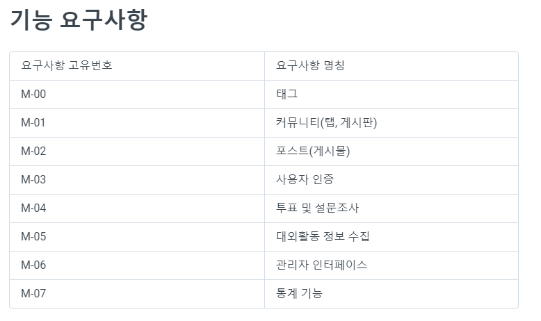
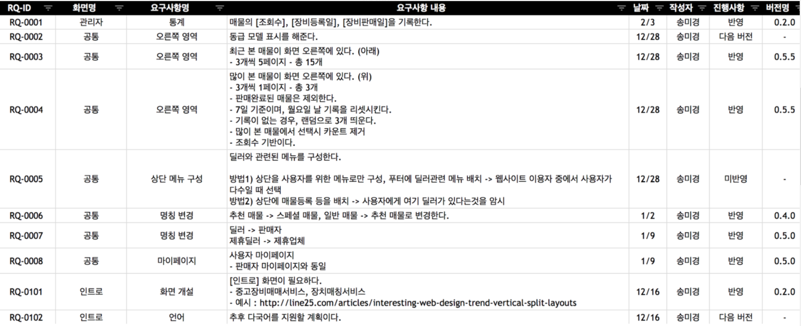
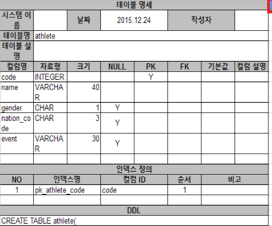

## 데이터베이스 설계 가이드

1. 데이터 요구사항에 대한 분석(요구사항 명세서 작성)
   - 요구 사항만 보고 프로그래머가 데이터베이스를 짤 수 있을 정도로 상세하게 설정해 주는 것이 좋으며 모든 상황을 예상해서 자세하게 설정해야 함
2. 개념 스키마 설계(ERD)
   * 작성한 요구사항 명세서에서 데이터베이스를 구성하는데 필요한 개체, 속성, 릴레이션을 추출하여 ERD를 생성
3. 논리 스키마 설계(릴레이션 스키마의 테이블 명세서)
4. 내부 스키마 설계(DB 스키마 생성 SQL 문)

### 1) 요구사항 명세서(Software Requirements Specification)

- 서비스를 구현하기 위한 다양한 요구사항을 분석하여 명확하고 완전하게 정리 기록한 문서
- 소프트웨어 시스템이 수행해야 할 모든 기능과 구현상의 제약 조건에 대해 개발자와 관련자(클라이언트, 기획자, 경영진)가 합의한 스펙에 대한 사항을 명시
- 작성된 명세서를 기반으로 회의가 진행됨
- 좋은 요구사항 명세서의 특징
  - 좋은 요구사항 명세서는 작업자(개발자, 디자이너)가 이해하기 쉬워야 함
  - 하나의 요구사항에 여러가지 요구사항을 작성하지 않음
  - 동일한 용어를 사용함 -> 같은 의미를 갖는 단어는 하나로 통일함
  - 난이도가 있거나 프로젝트 기간이 짧아 모든 요구사항을 그현하기 어려울 상황에선 대체 가능한 다른 방법도 함께 기술하여 전달하기

예시 1)

출처: https://bonfire-2.gitbook.io/modakbul/undefined-2/undefined

예시2)

출처:https://mklab-co.medium.com/%EC%9E%91%EC%84%B1%EB%B2%95-%EC%9A%94%EA%B5%AC%EC%82%AC%ED%95%AD-%EB%AA%85%EC%84%B8%EC%84%9C-requirements-specification-ad3533d6d5b8

### 2) 개념 스키마 및 논리 스키마 설계

* 개체와 속성을 추출하기

* 개체 간의 관계 추출하기(1:1 , 1:N, N:M)

* 분석 내용을 바탕으로 ERD 구성

* 테이블 명세서 만들기

  

테이블 명세서 예시)

### 3) 물리적 스키마 설계

* SQL 명령어를 통해 개념 스키마를 물리적으로 구현

출처: 

1) https://advenoh.tistory.com/31
2) https://blog.naver.com/PostView.nhn?blogId=offbeat1020&logNo=221977297245&parentCategoryNo=&categoryNo=114&viewDate=&isShowPopularPosts=true&from=search

3. https://bonfire-2.gitbook.io/modakbul/undefined-2/undefined
4. https://blog.naver.com/PostView.nhn?isHttpsRedirect=true&blogId=ljh0326s&logNo=220910609226&parentCategoryNo=&categoryNo=&viewDate=&isShowPopularPosts=false&from=postView

